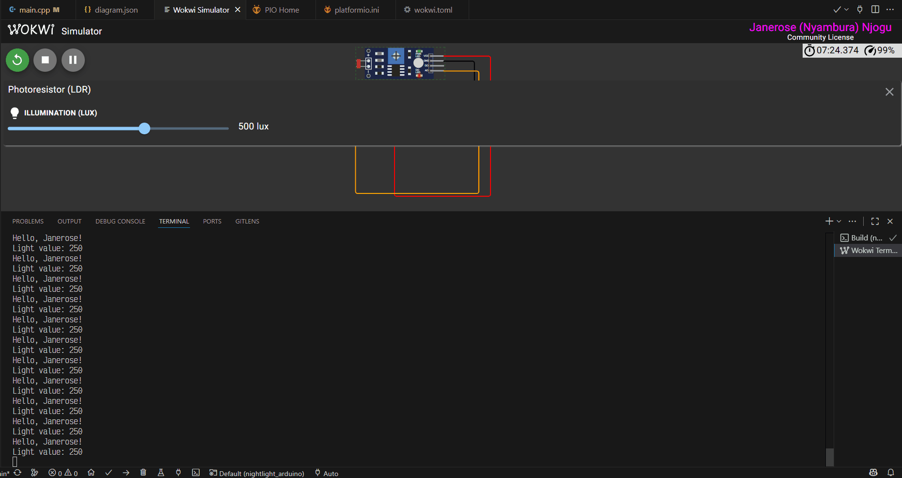

# Nightlight (Arduino)
This folder contains an example "nightlight" project for Arduino Nano (ATmega328P). The code demonstrates reading a light sensor (Photoresistor - LDR).

It works using a simulated environment powered by the Wokwi simulator.

PlatformIO builds and compiles the code in `src/main.cpp` for any microcontroller unit (MCU) supported by PlatformIO. The MCU configuration details are defined in `platformio.ini` in the project root folder.

Running the build command creates compiled firmware files (e.g. `firmware.hex` or `firmware.bin` and `firmware.elf`) inside the .pio/build/<board_name>/ directory. These files should be included in the `wokwi.toml` file in the project root folder. 

The compiled firmware files can then be uploaded to a physical MCU or a simulated MCU in wokwi.

Examples: 
- `.pio/build/nanoatmega328/firmware.elf`
- `.pio/build/nanoatmega328/firmware.hex`
- `.pio/build/nanoatmega328/firmware.bin`(for some boards)

To change the processing logic for the Arduino MCU, edit `src/main.cpp` then click Build to Compile the new code changes.

To simulate a different board or change virtual wiring, edit `wokwi.toml` and/or `diagram.json` and restart the simulation.

To run on real hardware instead, use PlatformIO: Build → Upload, then open the PlatformIO Serial Monitor to view any Serial output if present.

## Features:
- Read light intensity values from a photoresistor (LDR).

## Prerequisites
- Wokwi simulator for VS Code.
- PlatformIO extension for VS Code.
- (Optional) 1× microcontroller board: ATmega328 [Arduino Nano 3.x](https://docs.arduino.cc/hardware/nano/) and USB cable to connect it to your PC.

## Getting started with PlatformIO(pio) and Wokwi
1. Install VS Code, PlatformIO extension in VS Code and the Wokwi extension in VS Code for local simulation.
2. For the best experience, open a new VS Code window: File → New Window. Wait for PlatformIO to finish initializing.
3. Click the PlatformIO icon on the left activity toolbar in VS Code and then click **Pick a Folder**.
4. In the File Explorer, navigate to this folder i.e. `IoT-For-Beginners/7-janerose-projects/1-getting-started/nightlight_arduino/`
5. Click **Select Folder** to open this folder in VS Code.
6. Wait for PlatformIO to finish indexing the project.
7. In the project root, ensure that these 2 files exist:
  - `wokwi.toml` (defines the simulator configuration)
  - `diagram.json` (defines the simulated circuit)
8. Open `src/main.cpp` to view the Arduino sketch. To compile this code, click the PlatformIO icon on the left activity toolbar and then click **Build**.
  (Optional) If you have a physical Arduino Nano 3.x board then connect the board to the PC via USB and click **Upload** to upload the code to the board.
9. If the build is successful, open the `diagram.json` file and click the green Play icon in the top left corner OR open the Command Palette (Ctrl+Shift+P) → click "Wokwi: Start Simulator".

A new Wokwi Simulator tab will appear with an open terminal. The PlatformIO serial output will stream to the integrated terminal in VS Code.

You should see a Hello message and light readings printed every few seconds.

To adjust the light value, click on the photoresistor/LDR component on the Wokwi simulation. Move the slider to change the light level.

### How it works
Reads analog light level on A0 pin and prints the value to Serial. Example of serial output:
> Hello, Janerose

> Light reading: 745

## Getting started with a Physical Arduino Nano MCU and PlatformIO
1. Install VS Code and PlatformIO extension in VS Code.
2. Open a new VS Code window: File → New Window. Wait for PlatformIO to finish initializing.
3. Click the PlatformIO icon on the left activity toolbar in VS Code and then click **Pick a Folder**.
4. In the File Explorer, navigate to this folder i.e. `IoT-For-Beginners/7-janerose-projects/1-getting-started/nightlight_arduino/`
5. Click **Select Folder** to open this project in VS Code.
6. Wait for PlatformIO to finish indexing the project.
7. Connect the Arduino Nano board to your PC via USB.
8. Click the PlatformIO icon on the left activity toolbar in VS Code and then click **Build**.
9. Click the PlatformIO icon on the left activity toolbar in VS Code and then click **Upload and Monitor**.

The PlatformIO serial output will stream to the integrated terminal in VS Code.
Make sure to put the Nano into upload mode if required by your bootloader (follow board-specific steps).

## Project structure
- src/
  - main.cpp —  the Arduino sketch (C++ source) that implements setup() and loop(); compiled and uploaded by PlatformIO. Contains code that   reads sensors input, controls outputs, and prints to Serial.
- wokwi.toml — Wokwi simulator project configuration (board type, MCU, simulation options and any virtual component bindings) used by the Wokwi VS Code extension to launch the virtual device.
- diagram.json — JSON description of the circuit (component positions and wiring) used by Wokwi to render and reproduce the schematic for the virtual simulation
- etc/ — supporting images and GIFs.

## Troubleshooting
- Serial monitor shows nothing:
  - Confirm correct COM/serial port is selected.
  - Ensure board is powered and `Serial.begin` baud matches monitor.
- Upload fails:
  - Put board into bootloader/upload mode if required.
  - Check USB cable (data-capable).
- Sensor always reads 0 or constant:
  - Verify wiring.
  - In Wokwi set sensor pin and value correctly in the UI.
- Board is not detected:
  - Check the USB cable connection and ensure it is not loose.
- Compilation errors:
  - Check the output for specific error messages.
  - Ensure that you have the correct board type and that necessary libraries are installed.
- Unexpected behavior:
  - Check the wiring `diagram.json` and the processing logic in `main.cpp`.

## References
- PlatformIO docs: https://platformio.org/
- Wokwi docs: https://wokwi.com/
- Arduino Nano hardware: https://docs.arduino.cc/hardware/nano/
