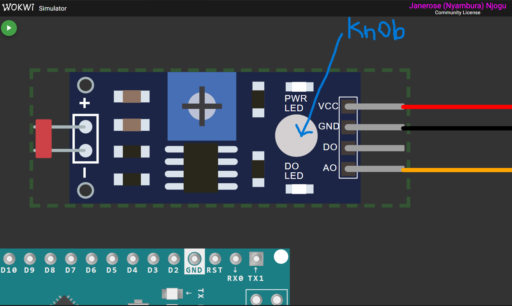
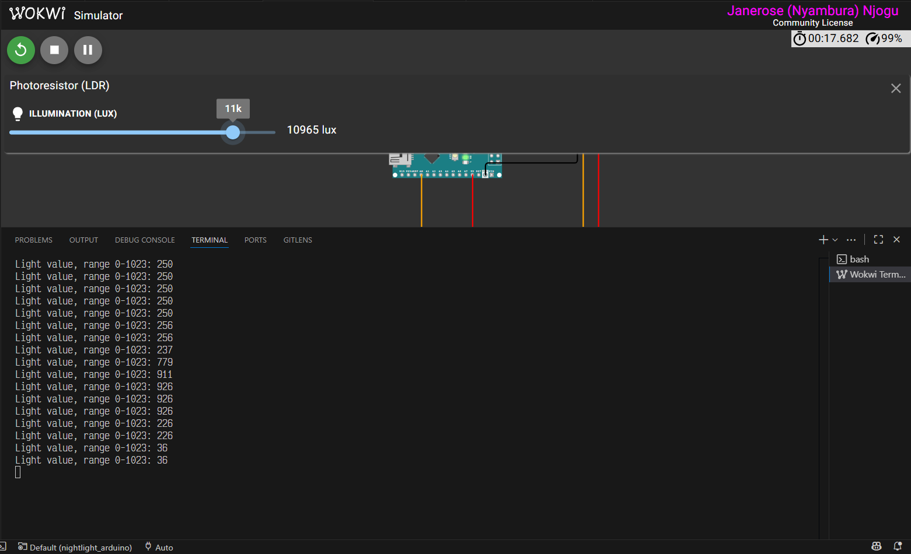
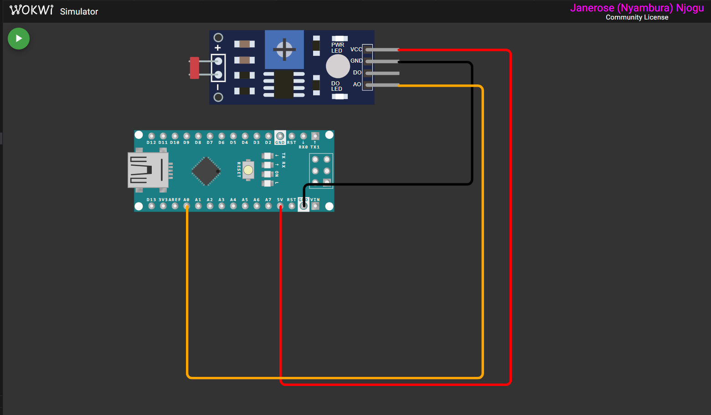

# Getting Started — Janerose IoT Projects

## Overview
This folder contains beginner-friendly, hands-on IoT projects to help you get started with microcontrollers (Arduino) both virtual and physical.

Each project contains sample code and configuration.

## Prerequisites
- Basic familiarity with a microcontroller platform such as PlatformIO
- A USB cable and a PC running Windows OS
- Installed toolchain:
  - PlatformIO - VS Code extension
  - Wokwi - VS Code extension

## Hardware
These projects make use of virtual IoT hardware components powered by CounterFit.

- (Optional) 1× microcontroller board: ATmega328 [Arduino Nano 3.x](https://docs.arduino.cc/hardware/nano/)

## Source Code
- `src/main.cpp` - the Arduino sketch (C++ source) that implements setup() and loop(); compiled and uploaded by PlatformIO.
Contains code that reads sensors input, controls outputs, and prints to Serial.

- `wokwi.toml` - Wokwi simulator project configuration (board type, MCU, simulation options and any virtual component bindings) used by the Wokwi VS Code extension to launch the virtual device.

- `diagram.json` - JSON description of the circuit (component positions and wiring) used by Wokwi to render and reproduce the schematic for the virtual simulation.
.
## Setup and Flashing an Arduino Nano
1. Click the PlatformIO icon on the left activity toolbar (the icon resembles an ant or an alien)
2. Click Pick a Folder then navigate to the appropriate project folder (the folder should be appended with `_arduino`)
3. Once the folder is open, navigate to the `src/main.cpp` file.
4. Click Build in the Left Activity Bar or on the bottom left PlatformIO toolbar.
5. Click Upload to flash the board.
6. Click Monitor to view the output.

### Running and Verifying
- After flashing, open the Serial Monitor to view logs or sensor readings.
- Verify LED blinks or sensor values update as expected.

## Running Wokwi simulation (alternative to running on a physical Arduino nano)
1. Ensure the Wokwi VS Code extension is installed.
2. Ensure that `wokwi.toml` and `diagram.json` files exist in the project root folder.
3. Open the Command Palette (Ctrl+Shift+P) and run "Wokwi: Start Simulation" (or click the green "Simulate" / "Play" button provided by the extension when editing `diagram.json`).
4. Wait for the simulator tab and terminal to open. The virtual board and circuit from `diagram.json` will be displayed. The terminal displays any Serial output from the `main.cpp` file.
5. Move the sun slider on the LDR in Wokwi to change the light values.
 
6. Make code or wiring changes in the `diagram.json` or `wokwi.toml`, save, and restart the simulation to see updates.

## Notes:
PlatformIO builds code for any microcontroller unit.

Running the build command creates compiled firmware files (e.g. firmware.hex, firmware.elf) inside the `.pio/build/<board_name>/` directory, 
ready to be uploaded to a physical MCU or simulated MCU in wokwi.

Examples:
`.pio/build/nanoatmega328/firmware.elf`
`.pio/build/nanoatmega328/firmware.hex`

To simulate a different board or change virtual wiring, edit `wokwi.toml` and/or `diagram.json` and restart the simulation.

To run on real hardware instead, use PlatformIO: Build → Upload, then open the PlatformIO Serial Monitor.

To change the processing logic for the Arduino MCU, edit `src/main.cpp` the click **Build** to compile the new code changes.

## Troubleshooting
- If the board is not detected then check your cable.
- If you encounter compilation errors then ensure that you have the correct board type and that necessary libraries are installed.
- If the output is not as expected in the virtual simulation then check the wiring `diagram.json` and the processing logic in `main.cpp`.

## License
Check the LICENSE file in the repository root for licensing details.
