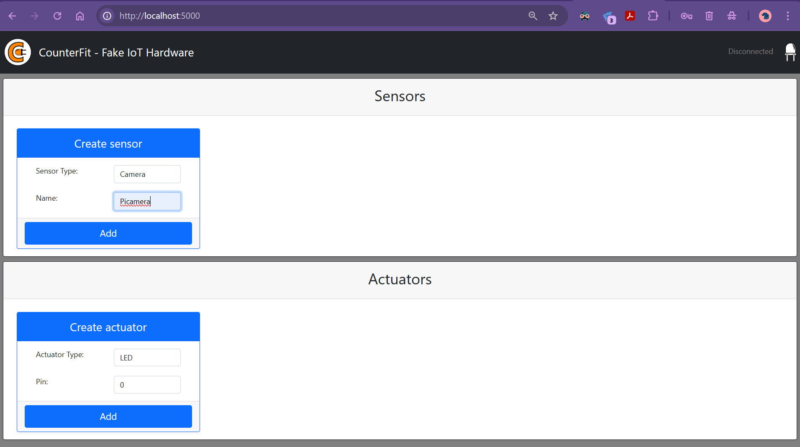
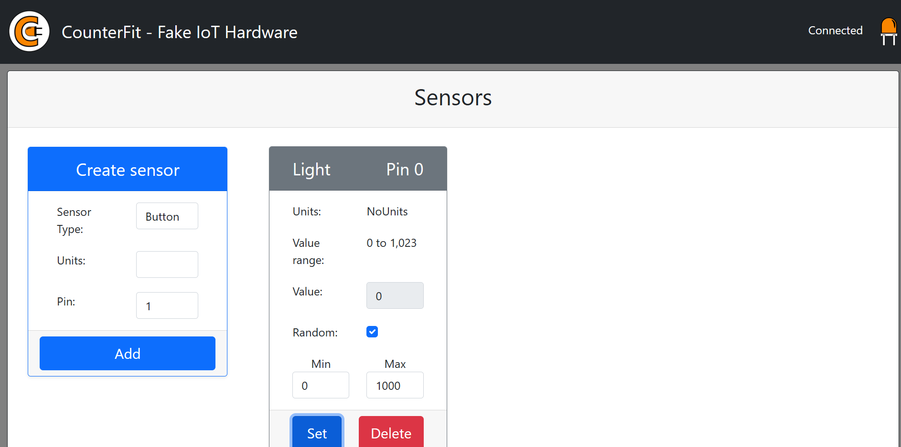
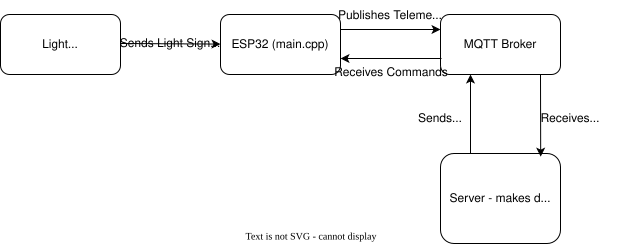
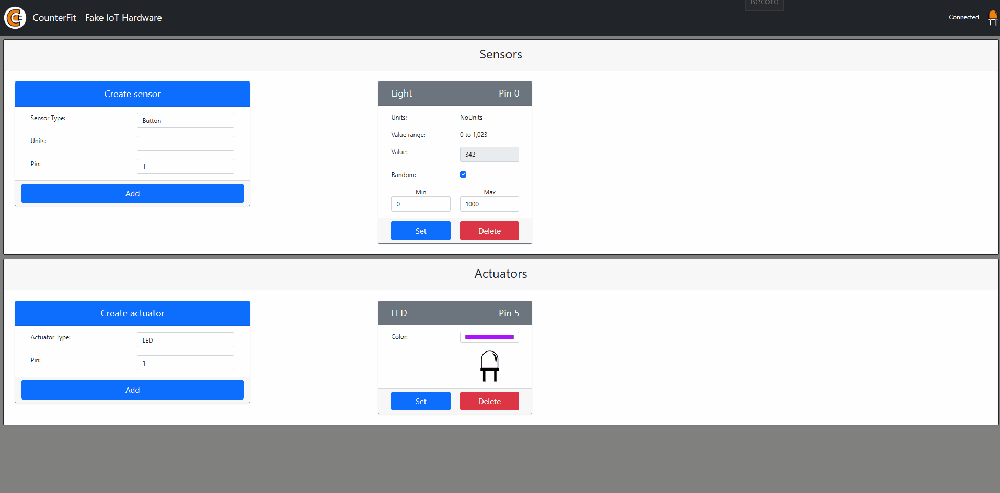
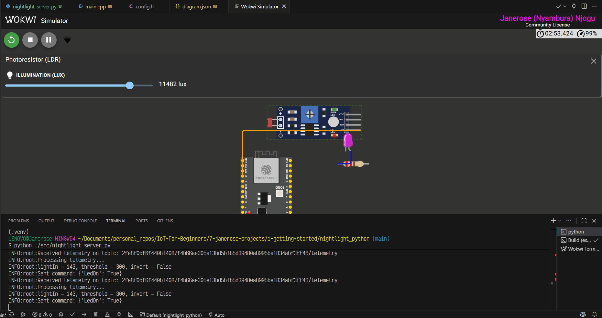

# Nightlight (Python - with CounterFit and MQTT)
This project contains code to run virtual devices with CounterFit.

This repository contains example code to connect to a CounterFit server, read a Grove light sensor, and capture images from a PiCamera sensor simulated by CounterFit.

This project also covers sending telemetry data to an MQTT broker and receiving commands to control a Grove LED shim.

## Features
- Read simulated light sensor values (Grove Light Sensor shim).
- Capture and save images using the PiCamera shim or a webcam source provided by CounterFit.
- Intended for use with the CounterFit virtual device server (local web UI - http://localhost:5000/).
- Send telemetry data to an MQTT broker (test.mosquitto.org).
- Receive commands from the MQTT broker to control a Grove LED shim.

## Prerequisites
- Python 3.13+

## Project dependencies installed via pip
- counterfit
- counterfit-shims-grove
- counterfit-shims-picamera
- counterfit-shims-serial
- werkzeug==2.2.3 (compatibility note)

## Getting started
1. Create and activate a virtual environment
   - Windows PowerShell:
     ```
     python -m venv .venv
     .venv\Scripts\Activate.ps1
     ```
   - Windows cmd:
     ```
     python -m venv .venv
     .venv\Scripts\activate
     ```
    - bash:
      ```bash
      pip
      source .venv\Scripts\activate
      ```
2. Install dependencies:
   - If a requirements.txt file exists in project root folder:
     ```bash
     pip install -r requirements.txt
     ```
   - Otherwise:
     ```bash
     pip install counterfit counterfit-shims-grove counterfit-shims-picamera counterfit-shims-serial werkzeug==2.2.3
     ```
3. Start CounterFit server running locally
   ```bash
   Counterfit
   ```
   Open [http://localhost:5000/](http://localhost:5000/) in a browser.

## To capture photos using simulated PiCamera:
1. In the CounterFit web UI → Sensors → Create sensor.
2. Select Sensor type: Camera.
3. Name: **Picamera** (any other name will not be picked up by CounterFit server).
4. Click Add
5. Source: **WebCam**.
6. Click Set.
The camera sensor will appear in the sensor list and is ready to capture images.
7. Run `camera.py` script to capture and save images to file:
```bash
python "./src/camera.py"
```



8. Check the project folder for captured images named `camera_image_YYYYMMDD_HHMMSS.png`.

## To capture light levels using simulated Grove Light Sensor:
1. In the CounterFit web UI → Sensors → Create sensor.
2. Select Sensor type: Light.
3. Units: NoUnits (default).
4. Pin: 0
5. Click Add
The virtual light sensor is active and ready to simulate light signals.
6. Run `light.py` script to read and print light values:
```bash
python "./src/light.py"
```

7. Set a fixed Value or check the box written Random and enter Min/Max values to automatically simulate changing light intensities. The **Random** option for the light sensor in CounterFit can be used to simulate dynamic light intensity behavior.

## Relevant files:
- src/
  - light.py        — example light sensor loop (reads GroveLightSensor on pin 0)
  - camera.py       — example camera capture script
  - nightlight.py   — example combining light sensor and LED with MQTT telemetry/commands logic
- etc/              — supporting images and GIFs
- docs/             — supporting documentation
- requirements.txt  — project dependency list

## Telemetry and Commands
A device connects to the public MQTT broker at `test.mosquitto.org` using a unique client ID.

Device publishes telemetry to:
- telemetry topic = CLIENT_ID + "/telemetry"

Device listens for server commands on:
- command topic = CLIENT_ID + "/command"

An MQTT client (mosquitto_sub, MQTT.fx, or paho-mqtt) watches both topics.

The telemetry payload (published by device) is a JSON object with the following fields:
  - "lightIn": integer analog light reading (0—1023)
  - "timestamp": UNIX epoch in milliseconds

Example:
{
  "lightIn": 412,
  "timestamp": 1700000000000
}

The command payload (published by controller/server) is a JSON object with the following field:
  - "LedOn": boolean to request LED state

Example: {"LedOn": true}

### Direction / flow
1. Device reads the light sensor and publishes telemetry to the telemetry topic.
2. A server or controller subscribes to the **telemetry** topic, processes the reading, and publishes a command JSON to the **command** topic.
3. The device subscribes to the **command** topic.

FYI: the device may receive its own messages if the broker echoes published messages to subscribers on the same client (self-loop). 

Current sample publishes every ~2 seconds. paho-mqtt defaults are QoS 0, no retain. Adjust QoS/retain when reliability is required.

Timestamps are milliseconds since epoch (int(time.time() * 1000)). Devices without real-time clocks should rely on the server for authoritative time if required.



### Simulating telemetry and commands with CounterFit
Ensure CounterFit server is running locally (http://localhost:5000/) before executing the scripts.

If the server is not running, then execute the command in a separate terminal window with a virtual environment containing the project dependencies installed:
```bash
Counterfit
```

Create a light sensor in the CounterFit web UI as described above.

Check the box for **Random** and enter Min/Max values to simulate changing light intensities automatically.

Create a Grove LED shim in the CounterFit web UI:
1. In the CounterFit web UI → Actuator Type → LED.
2. Select Pin: 5
3. Click Add
4. The LED will appear in the actuator list and is ready to be controlled.
5. (Optional) Click the LED color to change its color.

Run the nightlight.py script to simulate telemetry and commands using CounterFit:
```bash
python "./src/nightlight.py"
```
You should also see the LED turn ON or OFF depending on the light sensor value.



### Simulating telemetry and commands with wokwi and PlatformIO
1. Install VS Code, PlatformIO extension in VS Code and the Wokwi extension in VS Code for local simulation.
2. For the best experience, open a new VS Code window: File → New Window. Wait for PlatformIO to finish initializing.
3. Click the PlatformIO icon on the left activity toolbar in VS Code and then click **Pick a Folder**.
4. In the File Explorer, navigate to this folder i.e. `IoT-For-Beginners/7-janerose-projects/1-getting-started/nightlight_python/`
5. Click **Select Folder** to open this folder in VS Code.
6. Wait for PlatformIO to finish indexing the project.
7. In the project root, ensure that these 2 files exist:
  - `wokwi.toml`   (defines the simulator configuration)
  - `diagram.json` (defines the simulated circuit)
8. Open `src/main.cpp` to view the Arduino sketch. To compile this code, click the PlatformIO icon on the left activity toolbar and then click **Build**.
9. If the build is successful, open the `diagram.json` file and click the green Play icon in the top left corner OR open the Command Palette (Ctrl+Shift+P) → click "Wokwi: Start Simulator".

A new Wokwi Simulator tab will appear with an open terminal. Wokwi will connect to a Wireless network through a public IoT Gateway (no internet access).

Run the nightlight_server.py script to start the telemetry and command simulation:
```bash
python "./src/nightlight_server.py"
```

You should see the LED turn ON or OFF depending on the light sensor value. Change the light value by clicking on the photoresistor/LDR component on the Wokwi simulation. Move the slider to change the light level.



## Security
This example uses the public test broker (`test.mosquitto.org`) — do not use for production or sensitive data.

Use authenticated TLS brokers and unique client IDs in production.

## Troubleshooting
- If values stay at 0: ensure the light sensor is created and assigned to pin 0 in CounterFit.
- If camera capture fails: confirm Picamera sensor exists and Source is set to WebCam (and the camera is available).
- If you see werkzeug compatibility errors: try werkzeug==2.2.3 as noted above.
- Make sure the terminal session has the venv activated when running scripts.
- Check whether the device is receiving its own telemetry messages and interpreting them instead of real server telemetry.
- Verify CounterFit sensor pin mapping and that the Grove LED shim is correctly instantiated with the appropriate pin number.
- If the LED command appears in the terminal logs but the virtual LED does not change, then check the broker logs (test.mosquitto.org has public restrictions — use a local broker for debugging if needed).

# References and Final Remarks
- paho-mqtt Python client: https://pypi.org/project/paho-mqtt
- CounterFit project: https://pypi.org/project/CounterFit/ (refer to official docs for server usage)
- Sample wokwi project: https://wokwi.com/projects/374918984668172289
- This project is designed for learning and simulation; do not use it in production environments without appropriate security and hardware validation.
