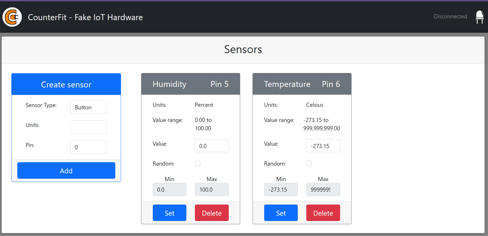
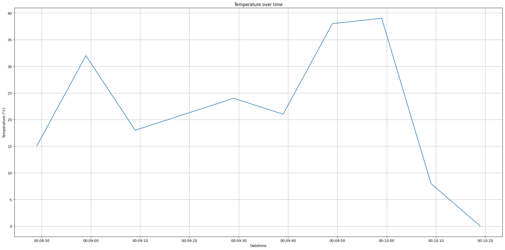

# Farm IoT Project
This project simulates a farm environment with temperature and humidity sensors using CounterFit.

## Features
- Simulated temperature and humidity sensors (DHT11).

## Prerequisites
- Python 3.13+

## Project dependencies installed via pip
- counterfit
- counterfit-shims-grove
- counterfit-shims-picamera
- counterfit-shims-serial
- counterfit-shims-seeed-python-dht
- werkzeug==2.2.3 (compatibility note)

## Getting started
1. Create and activate a virtual environment
   - Windows PowerShell:
     ```
     python -m venv .venv
     .venv\Scripts\Activate.ps1
     ```
   - Windows cmd:
     ```
     python -m venv .venv
     .venv\Scripts\activate
     ```
    - bash:
      ```bash
      pip
      source .venv\Scripts\activate
      ```
2. Install dependencies:
   - If a requirements.txt file exists in project root folder:
     ```bash
     pip install -r requirements.txt
     ```
   - Otherwise:
     ```bash
     pip install counterfit counterfit-shims-grove counterfit-shims-picamera counterfit-shims-serial werkzeug==2.2.3
     ```
3. Start CounterFit server running locally
   ```bash
   Counterfit
   ```
   Open [http://localhost:5000/](http://localhost:5000/) in a browser.


### Add a virtual humidity sensor to CounterFit
1. In the CounterFit web UI → Sensors → Create sensor.
2. Select Sensor type: Humidity.
3. Leave the Units set to Percent.
4. Ensure the Pin is set to 5.
5. Click Add.

### Add a virtual temperature sensor to CounterFit
1. In the CounterFit web UI → Sensors → Create sensor.
2. Select Sensor type: Temperature.
3. Leave the Units set to Celsius.
4. Ensure the Pin is set to 6.
5. Click Add.

The sensors will appear in the sensor list and are ready to provide simulated readings.


CounterFit simulates this combined humidity and temperature sensor by connecting to 2 sensors, a humidity sensor on the pin given when the DHT class is created, and a temperature sensor that runs on the next pin. If the humidity sensor is on pin 5, the shim expects the temperatures sensor to be on pin 6.

Run `farm.py` script to read temperature and humidity from the virtual humidity and temperature sensors:
```bash
python "./src/farm.py"
```

From the CounterFit app, change the value of the temperature and humidity sensor that will be read by the app. You can do this in one of two ways:
- Enter a number in the Value box for the temperature sensor, then select the Set button. The number you enter will be the value returned by the sensor.
- Check the Random checkbox, and enter a Min and Max value, then select the Set button. Every time the sensor reads a value, it will read a random number between Min and Max.

You should see the values you set appearing in the console. Change the Value or the Random settings to see the value change.

Example:
```bash
INFO:root:Temperature: -269
INFO:root:Humidity: 76
```

## Adding Telemetry and Command
The project code includes MQTT telemetry and command handling.

The virtual IoT device publishes temperature and humidity telemetry to the topic `/telemetry`.

Ensure that CounterFit server is running locally and that both the humidity and temperature sensors are added in CounterFit.

Run `farm.py` script to read temperature and humidity from the virtual sensors and publish telemetry:
```bash
python "./src/farm.py"
```
You should see the values you set appearing in the console. Change the Value or the Random settings to see the value change.

Example:
```bash
INFO:root:Temperature: 37
INFO:root:Humidity: 3
INFO:root:Publishing telemetry: {"temperature": 37, "humidity": 3, "timestamp": 1759004706424}
```
## Capture and store the sensor data
Once the IoT device is publishing telemetry, the server code can be written to subscribe to this data and store it either in a database or as a file.

The CSV file will have two columns - date and temperature. The date column is set as the current date and time that the message was received by the server, the temperature comes from the telemetry message.

*Select the random checkbox and set a range to avoid getting the same temperature every time the temperature value is returned.*

## Visualize the temperature data
The `gdd-calculation.ipynb` Jupyter notebook reads the temperature data from the CSV file and plots it using Matplotlib.

